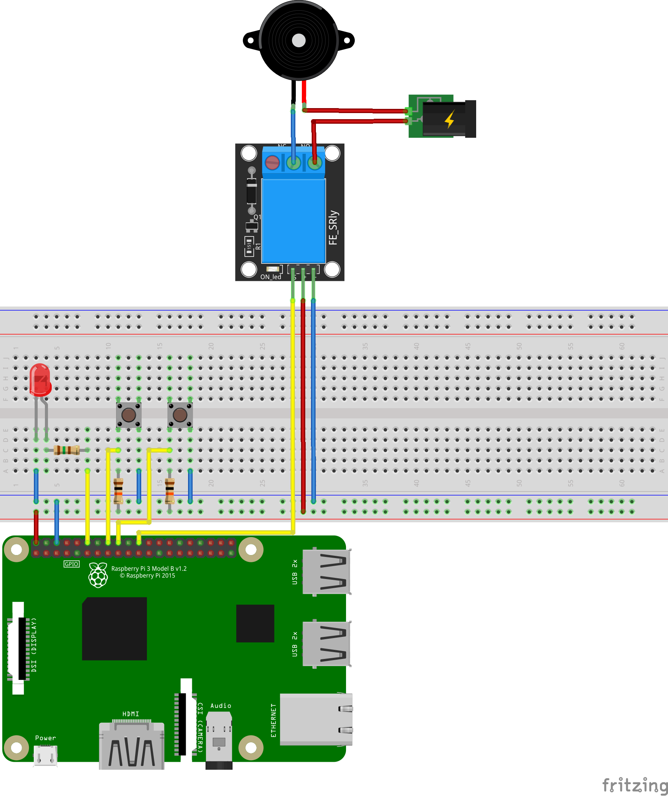
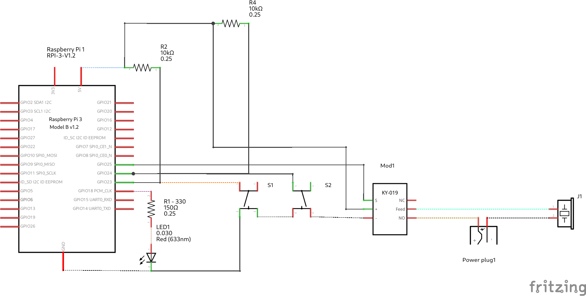
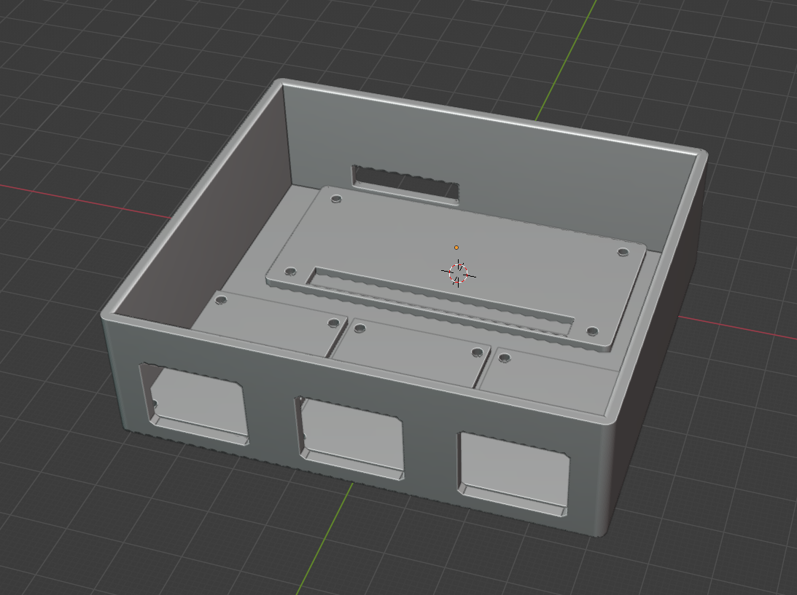

# raspidoor

![CI Status][ci-img-url] 
[![Go Report Card][go-report-card-img-url]][go-report-card-url] 
[![Releases][release-img-url]][release-url]

A door bell to phone call application for your Raspberry PI.

## What is _raspidoor_?

_raspidoor_ is a combination of hardware and software that uses a [Raspberry PI](https://www.raspberrypi.org/)
to respond to to door bell pushes by invoking a regular bell as well as ringing a SIP phone. It supports
multiple door pushes (such as a garden door, front door, garage, ...) as well as multiple "bells". _raspidoor_
comes with a web application that you can use to toggle different pushes or bells.

## How to use _raspidoor_?

_raspidoor_ uses some custom wiring to connect door pushes and external bells to your pi. This requires 
soldering and a couple of electronic parts (mainly connectors, resistors and relays).

The following picture shows an example breadboard setup with a single bell push and a single external bell.
The external bell is connected via a relay as it uses its own power supply. The LED is used to indicate the
status.



The following shows the schematic for this setup:



Note that this is not a mandatory setup. You can uses as much bell pushes and bells as you have GPIO lines
available.

## What is required to run the software?

The software is written in [golang](https://go.dev/). It uses 
[github.com/warthog618/gpiod](https://github.com/warthog618/gpiod) to access the GPIO lines which requires
a linux kernel >= 5.10. Running the software on a Raspberry PI with either Debian Buster or Bullseye works
fine (I run it on a Raspberry PI Zero W with Debian Buster and kernel 5.10). 

The software consists of multiple modules, three of which are dedicated applications:
* [`raspidoord`](./daemon) - the main daemon to manange to GPIO and issue SIP calls
* [`raspidoorwebd`](./webapp) - a web application to control the features of the daemon
* [`raspidoor`](./cli) - a command line interface application to control the features of the daemon

The control apps connect to the daemon using a Unix socket using a [gRPC](https://grpc.io/) protocol. Thus,
they need to have access to the daemons file system (i.e. run on the same PI).

## How to install the software?

The software is packaged as a single debian package. The package is not yet published to an `apt` repo, but
you can download and install the package yourself. The single package provides:
* the daemon
* the web app
* the cli
* systemd service files for both the daemon and web app
* default configuration

## How to run the software?

Once you installed the debian package on your raspberrypi you can configure the application. The file
`/etc/raspidoor/raspidoord.yaml` contains a commented default configuration showing you how to configure the
application. Although it is technically possible to edit this file, this is not recommended, as the file will
be overwritten by package updates. Instead, create a file named `/etc/raspidoor/conf.d/raspidoord.yaml` and
put in all configuration keys you wish to change. This file will be loaded to override the default values and
will not be touched by any package operation.

After editing the configuration, you can start the services by running

```shell
sudo systemctl start raspidoor
```

## How to build the software?

To build the software, you need a couple of tools installed. The easiest way is to use 
[docker](https://www.docker.com/). To run the build, you can simply issue

```shell
make docker-build-deb
```

This will compile all the sources and create a debian package in the `out` directory as part of a docker image
run. The resulting debian package is then copied from the container using a volume. Simply copy that
package to your raspberry pi and install it.

If you want to build and test the software locally, you need at least the following:

* golang >= 1.18-rc1 to test and run the applications
* GNU Make which orchestrates the build
* protocol buffers compiler with go plugin if you want to make changes to the control protocol
* `dpkg-deb` to build the debian package for installation on a raspberry pi

The software consists of the following modules (all written in golang):

* [`controller`](./controller) - library containing the gRPC IDL as well as generated go sources which make up
  the control protocol
* [`systemd`](./systemd)  - library containing utilities to implement linux systemd services
* [`daemon`](./daemon) - application that runs the "main" daemon
* [`cli`](./cli) - application that provides the command line interface
* [`webapp`](./webapp) - application that provides the web app to control the daemon

This mono-repo features the new _golang workspace_.

## Case

I created a case for 3d printing using Blender:



You can download the [Blender File](./doc/raspidoor.blend) or the [STL](./doc/raspidoor.stl).

## License

Copyright 2022 Alexander Metzner

Licensed under the Apache License, Version 2.0 (the "License");
you may not use this file except in compliance with the License.
You may obtain a copy of the License at

[http://www.apache.org/licenses/LICENSE-2.0](http://www.apache.org/licenses/LICENSE-2.0)

Unless required by applicable law or agreed to in writing, software
distributed under the License is distributed on an "AS IS" BASIS,
WITHOUT WARRANTIES OR CONDITIONS OF ANY KIND, either express or implied.
See the License for the specific language governing permissions and
limitations under the License.

[ci-img-url]: https://github.com/halimath/raspidoor/workflows/CI/badge.svg
[go-report-card-img-url]: https://goreportcard.com/badge/github.com/halimath/raspidoor
[go-report-card-url]: https://goreportcard.com/report/github.com/halimath/raspidoor
[release-img-url]: https://img.shields.io/github/v/release/halimath/raspidoor.svg
[release-url]: https://github.com/halimath/raspidoor/releases